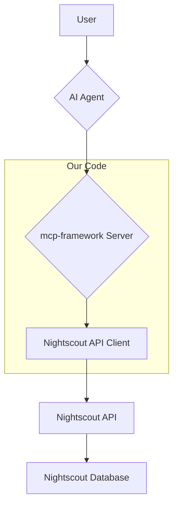

# **Design Document: Nightscout MCP Server**

## **1. High-Level Architecture**

The server will be built using the **`mcp-framework`**, which provides a robust foundation for creating MCP-compliant servers. The framework will handle the underlying JSON-RPC 2.0 communication, allowing us to focus on implementing the tools.

The following diagram illustrates the high-level architecture:



## **2. Data Models**

The following TypeScript interfaces define the data structures used by the MCP server. These will be used in our API client and tool implementations.

### **2.1. Treatment**

```typescript
interface Treatment {
  _id: string;
  app: string;
  date: number;
  eventType: string;
  insulin?: number;
  isBasalInsulin: boolean;
  isReadOnly: boolean;
  isValid: boolean;
  pumpId?: number;
  pumpSerial?: string;
  pumpType?: string;
  type: string;
  utcOffset: number;
  created_at: string;
  identifier: string;
  srvModified: number;
  srvCreated: number;
  subject: string;
  carbs?: number;
  duration?: number;
  durationInMilliseconds?: number;
  rate?: number;
  absolute?: number;
  notes?: string;
  endId?: number;
  modifiedBy?: string;
}
```

### **2.2. Entry**

```typescript
interface Entry {
  _id: string;
  app: string;
  date: number;
  device: string;
  isReadOnly: boolean;
  isValid: boolean;
  type: string;
  utcOffset: number;
  created_at: string;
  identifier: string;
  srvModified: number;
  srvCreated: number;
  subject: string;
  mills: number;
}

interface SGV extends Entry {
  direction: string;
  filtered: number;
  sgv: number;
  unfiltered: number;
  units: 'mg/dl' | 'mmol/L';
}
```

### **2.3. Profile**

```typescript
interface TimeBasedValue {
  time: string;
  timeAsSeconds: number;
  value: number;
}

interface ProfileSettings {
  dia: number;
  carbratio: TimeBasedValue[];
  sens: TimeBasedValue[];
  basal: TimeBasedValue[];
  target_low: TimeBasedValue[];
  target_high: TimeBasedValue[];
  units: 'mmol' | 'mg/dl';
  timezone: string;
}

interface ProfileStore {
  [name: string]: ProfileSettings;
}

interface Profile {
  _id: string;
  defaultProfile: string;
  date: number;
  created_at: string;
  startDate: string;
  store: ProfileStore;
  app: string;
  utcOffset: number;
  identifier: string;
  srvModified: number;
  srvCreated: number;
  subject: string;
}